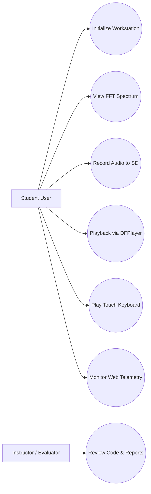
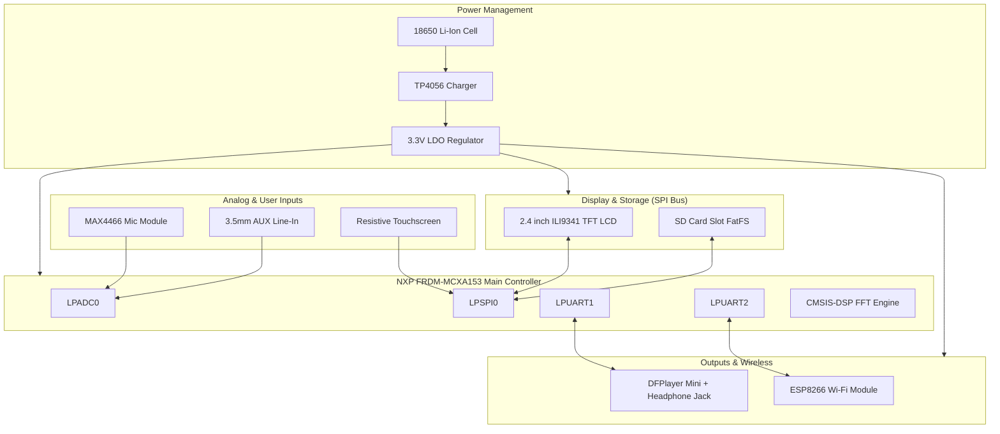

# Multi-Mode Touchscreen Audio Workstation: Real-Time FFT Analyzer, Smart Recorder & Digital Synthesizer

> Documentation draft generated from Agent 0 and Agent 1 outputs.  
> AI assists. Humans decide.

## 1. Introduction

This project details the design and implementation of a portable, dual-mode embedded audio processing workstation built on the mandatory **NXP FRDM-MCXA153** development platform. The system integrates real-time digital signal processing (DSP), high-speed display rendering, audio recording and playback, touch-driven user interaction, and wireless IoT telemetry.

The primary objective is to turn a raw MCU platform into a mixed-signal audio instrument. Audio signals from a preamplified microphone (MAX4466) or an auxiliary 3.5mm line-in jack are sampled via ADC and DMA. The Cortex-M33 core computes real-time Fast Fourier Transforms (FFT) using the ARM CMSIS-DSP library, displaying a 60 FPS graphical spectrum bar graph on a 2.4-inch ILI9341 SPI TFT LCD Touchscreen. Users can navigate modes, record WAV audio files to an SD Card, trigger hardware MP3/WAV playback via DFPlayer Mini, synthesize piano notes on a graphical touch keyboard, and monitor telemetry wirelessly via an ESP8266 Wi-Fi module.

The **NXP FRDM-MCXA153** board is mandatory for all summer school projects, providing a Cortex-M33 core with DSP instructions, flexible LPADC, LPSPI, and LPUART peripherals.

> This documentation is a draft and must be validated by students and instructors before implementation.

---

## 2. General Description

### 2.1 Project Summary

- **Project Name:** Multi-Mode Touchscreen Audio Workstation: Real-Time FFT Analyzer, Smart Recorder & Digital Synthesizer
- **Short Summary:** A dual-mode embedded audio workstation on FRDM-MCXA153 featuring real-time FFT spectrum visualization, audio recording to SD Card, DFPlayer playback, touchscreen synth, and ESP8266 Wi-Fi telemetry.
- **Main Objective:** Implement real-time audio analysis, touch GUI, SD Card file management, and wireless IoT streaming on a single MCU platform.
- **Intended Users:** Third-year Computer Science students, electronics hobbyists, and laboratory researchers.
- **Operating Environment:** Benchtop laboratory or portable handheld.
- **Selected Scope:** Recommended Summer School Version (with Core baseline and Advanced Wi-Fi extension).
- **Main Behavior:** LPADC sampling audio at 40 kHz via DMA, computing 256-point CMSIS-DSP FFTs, rendering 60 FPS spectrum graphs on 2.4" SPI TFT LCD, managing FatFS SD Card recording, playing back MP3/WAV via DFPlayer Mini, and handling Touch GUI inputs.
- **Inputs:** MAX4466 mic module, 3.5mm AUX line-in jack, 2.4" resistive touchscreen, onboard pushbuttons (SW2, SW3).
- **Outputs:** 2.4" ILI9341 SPI TFT LCD display, DFPlayer Mini 3.5mm headphone jack, MCU PWM/DAC audio tone generator, ESP8266 UART Wi-Fi stream.
- **Out-of-Scope Items:** 24-bit multi-track studio recording, high-power speaker driving above 1W, un-isolated 5V logic connections.

### 2.2 Feature Tiers

| Tier | Description | Main Features | Extra Components | Main Risks | Suitability |
|---|---|---|---|---|---|
| Core | Basic Audio Spectrum Analyzer | ADC sampling (40kHz), 256-pt CMSIS-DSP FFT, 60 FPS spectrum render on TFT LCD | MAX4466 Mic, 2.4" ILI9341 SPI TFT LCD | ADC sampling jitter, SPI screen update latency | Suitable (Beginner/Intermediate) |
| Recommended | Dual-Mode Touch Audio Workstation | Touch GUI, SD Card WAV recording (FatFS), DFPlayer Mini MP3/WAV playback, AUX line-in | DFPlayer Mini, 3.5mm AUX Jacks, TP4056 Charger, 18650 Battery | SPI bus contention between LCD and SD Card | Suitable (Intermediate) |
| Advanced | IoT Connected Workstation | ESP8266 UART Wi-Fi bridge, interactive Web Dashboard, Web-MIDI remote control | ESP8266 Wi-Fi Module | Peak current draw causing MCU voltage dips | Suitable (Advanced Extension) |

### 2.3 Scenarios

| ID | Scenario | Description |
|---|---|---|
| SC-001 | System Startup | MCU powers up, initializes LPADC, LPSPI0, LPUARTs, and displays the main menu on 2.4" TFT Touchscreen. |
| SC-002 | Spectrum Analyzer Mode | MCU samples audio at 40 kHz via LPADC+DMA, calculates 256-pt FFT, and renders 60 FPS spectrum bar graph. |
| SC-003 | Audio Recording Mode | User taps "Record" on Touchscreen; MCU streams 16-bit PCM WAV audio data to SD Card over SPI FatFS. |
| SC-004 | Touch Synth Mode | User taps "Synth" on Touchscreen; touching piano keys triggers sound synthesis and DFPlayer samples. |
| SC-005 | Wi-Fi Telemetry | ESP8266 background task transmits spectral peak data and system logs to a Web dashboard over Wi-Fi. |

### 2.4 User Stories

| ID | User Story |
|---|---|
| US-001 | As a student, I need real-time FFT spectrum visualization so that I can analyze audio frequencies visually. |
| US-002 | As a user, I need a Touchscreen GUI so that I can navigate between Analyzer, Recorder, and Synth modes easily. |
| US-003 | As a user, I need SD Card recording and playback so that I can capture audio clips and listen to them on headphones. |
| US-004 | As a user, I need Wi-Fi telemetry so that I can monitor audio spectrum statistics remotely on a web dashboard. |

### 2.5 Use Case Diagram



### 2.6 Hardware and Software Block Diagram



- **Power Flow:** 18650 Li-ion battery charges via TP4056 and feeds a 3.3V LDO regulator supplying clean power to MCXA153, display, and sensors.
- **Data/Control Flow:** Audio is eesantionat by LPADC0 via DMA, processed by CMSIS-DSP FFT, and rendered over LPSPI0 to ILI9341 LCD. Touch inputs navigate menus and select SD Card audio files.
- **Protection Needs:** Zener diode (3.3V) input protection on 3.3V AUX line-in. Decoupling capacitors (100nF) on power rails.

---

## 3. Hardware Design

### 3.1 Bill of Materials

| # | Component | Qty | Tier | Purpose | Likely Interface | Voltage / Power Notes | Risks / Checks |
|---|---:|---:|---|---|---|---|---|
| 1 | NXP FRDM-MCXA153 | 1 | Core | Main MCU Controller | Onboard | 3.3V VCC, USB Powered | Mandatory Board |
| 2 | 2.4" ILI9341 SPI TFT LCD + Touch + SD | 1 | Core | Display, Touch UI, SD Storage | SPI0 + GPIO CS | 3.3V Logic & VCC | Shared SPI CS management |
| 3 | MAX4466 Microphone Module | 1 | Core | Acoustic Audio Capture | LPADC Analog Input | 3.3V VCC, ~1.65V DC Bias | Overvoltage protection check |
| 4 | 3.5mm Stereo AUX Jack | 2 | Recommended | Line-In & Headphone Out | Analog Input / Audio Out | 3.3V Max swing | Requires Zener clamping |
| 5 | DFPlayer Mini MP3 Player | 1 | Recommended | Audio Playback | LPUART1 (9600 baud) | 3.3V - 5.0V VCC | Current spikes during audio output |
| 6 | ESP8266 Wi-Fi Module | 1 | Advanced | Wireless Telemetry & Web UI | LPUART2 (115200 baud) | 3.3V VCC, up to 300mA peak | Requires dedicated 3.3V LDO capacitor |
| 7 | TP4056 Charger & 18650 Cell | 1 | Recommended | Portable Power Supply | 3.3V Power Rail | 3.7V Nominal battery | Battery reverse polarity check |
| 8 | Pushbuttons (SW2, SW3) | 2 | Core | Mode Toggle / Reset | GPIO Input | 3.3V Pullup | Debounce filtering needed |

### 3.2 Hardware Block Diagram Description

The hardware centers around the **NXP FRDM-MCXA153** development board. Acoustic and line-in audio signals are acquired by the LPADC peripheral. Visual output is provided by a 2.4-inch ILI9341 SPI TFT display sharing an SPI bus with the SD Card socket. Touchscreen signals are processed via SPI/ADC GPIOs. Audio playback is routed through a DFPlayer Mini connected over UART, while wireless telemetry is handled by an ESP8266 Wi-Fi module over a secondary UART interface.

### 3.3 Pin Allocation Draft

| Component | Tier | Signal | Required MCU Capability | Suggested Pin / Capability | Voltage Level | Direction | Interface | Verification Needed |
|---|---|---|---|---|---|---|---|---|
| MAX4466 Mic | Core | Audio Out | LPADC Analog Input | ADC0_CH0 (P0_16) | 0 - 3.3V | Input | Analog | Pinout & gain verify |
| 3.5mm AUX Line-In | Recommended | Audio Line-In | LPADC Analog Input | ADC0_CH1 (P0_17) | 0 - 3.3V | Input | Analog | Zener diode clamp verify |
| ILI9341 TFT | Core | SPI SCK/MOSI | LPSPI SCK / SDO | P0_2 / P0_3 (LPSPI0) | 3.3V | Output | SPI | Clock rate check |
| ILI9341 TFT | Core | CS / DC / RST | GPIO Output | P0_4 / P0_5 / P0_6 | 3.3V | Output | GPIO | Pinmux verify |
| SD Card Slot | Recommended | SD CS | GPIO Output | P0_7 | 3.3V | Output | SPI CS | SPI bus sharing verify |
| DFPlayer Mini | Recommended | TX / RX | LPUART TX / RX | P1_8 / P1_9 (LPUART1) | 3.3V | Bidirectional | UART | Baud rate 9600 verify |
| ESP8266 Wi-Fi | Advanced | TX / RX | LPUART TX / RX | P2_0 / P2_1 (LPUART2) | 3.3V | Bidirectional | UART | Baud rate 115200 verify |

*Generic FRDM-MCXA153 capability only - exact pin requires board pinout and datasheet verification.*

### 3.4 Electrical Schematics

- `TODO: Add final schematic image or link.`
- `TODO: Add analog input Zener protection circuit diagram.`
- `TODO: Add power distribution and TP4056 wiring diagram.`

### 3.5 Signal Diagrams and Measurements

- `TODO: Add 40 kHz LPADC sampling timer oscilloscope capture.`
- `TODO: Add 60 FPS TFT SPI CS timing logic analyzer capture.`
- `TODO: Add 3.3V power rail noise measurement during ESP8266 transmission.`

---

## 4. Software Design

### 4.1 Development Environment

- **IDE & Toolchain:** MCUXpresso SDK, CMake, Ninja, GNU Arm Embedded Toolchain 14.2.
- **Key SDK Drivers:** `fsl_lpadc`, `fsl_lpspi`, `fsl_lpuart`, `fsl_ctimer`, `fsl_gpio`.
- **Libraries:** ARM CMSIS-DSP (`arm_cfft_f32`), FatFS SD Card File System.

### 4.2 Firmware Architecture

Bare-metal superloop architecture backed by interrupt-driven ADC sampling and DMA transfers:
1. **Startup Sequence:** Initialize system clocks (FRO12M/48M), pins (`BOARD_InitPins`), LPSPI0 display driver, FatFS SD Card driver, and LPUART consoles.
2. **Main Loop:**
   - Poll Touchscreen touch events and update active UI menu state.
   - Trigger LPADC double-buffered audio acquisition via CTIMER0.
   - Execute CMSIS-DSP 256-point FFT calculation on acquired audio block.
   - Render graphical FFT bar spectrum / oscilloscope waveform on ILI9341 LCD.
   - Handle background SD Card WAV writing and ESP8266 UART telemetry.

### 4.3 Main Algorithms and Data Structures

- **CMSIS-DSP Real FFT:** Computes 256-point complex FFT from 40 kHz sampled audio, calculating magnitude spectrum `sqrt(Re^2 + Im^2)`.
- **Decimation & Peak Hold:** Maps 128 frequency bins into 32 LCD spectrum bars with peak-decay animation.
- **FatFS WAV Header Generator:** Writes standard 44-byte RIFF/WAV header to SD Card file prior to streaming raw PCM audio.

### 4.4 Functional Requirements Summary

| ID | Tier | Requirement | Priority | Verification | Acceptance Criterion |
|---|---|---|---|---|---|
| FR-001 | Core | The system shall use NXP FRDM-MCXA153 board as main controller. | Must | Inspection | MCU powers up and runs firmware |
| FR-002 | Core | The system shall eesantionare audio via LPADC triggered by CTIMER at 40 kHz. | Must | Test | LPADC sample rate 40 kHz ± 1% |
| FR-003 | Core | The system shall compute 256-point FFT using ARM CMSIS-DSP library. | Must | Test | Peak frequency accuracy ± 50 Hz |
| FR-004 | Core | The system shall render FFT spectrum bar graph on 2.4" TFT LCD at 60 FPS. | Must | Test | Display update rate &ge; 50 FPS |
| FR-005 | Recommended | The system shall record WAV audio files to SD Card via SPI FatFS. | Should | Test | Recorded WAV plays back cleanly on PC |
| FR-006 | Recommended | The system shall provide Touchscreen GUI menu navigation. | Should | Demonstration | Tapping Touch UI switches screens |
| FR-007 | Advanced | The system shall stream telemetry data to Web dashboard via ESP8266. | Could | Demonstration | Telemetry received on Web UI over Wi-Fi |

### 4.5 Non-Functional Requirements Summary

| ID | Tier | Category | Requirement | Metric / Threshold | Verification |
|---|---|---|---|---|---|
| NFR-001 | Core | Power | All external modules shall operate at 3.3V logic level. | 3.3V ± 5% | Measurement |
| NFR-002 | Core | Timing | FFT calculation & display update loop time shall be under 16.6ms. | &le; 16.6 ms | Test |
| NFR-003 | Recommended | Reliability | SD Card file writing shall flush buffers every 1024 bytes. | &le; 1024 B | Inspection |

### 4.6 Test Plan Summary

| Test ID | Requirement | Tier | Test Type | Expected Result | Evidence |
|---|---|---|---|---|---|
| TC-001 | FR-001 | Core | Integration | MCU boots and logs debug text via LPUART0. | Serial Log |
| TC-002 | FR-003 | Core | Unit/DSP | 1 kHz sine input produces peak at 1 kHz FFT bin. | FFT Graph / Scope |
| TC-003 | FR-004 | Core | Performance | Frame toggle GPIO pin measures 60 Hz frequency. | Oscilloscope Trace |
| TC-004 | FR-005 | Recommended | System | SD Card WAV file created and readable on host PC. | File Screenshot |

### 4.7 Traceability Summary

| User Story | Requirement(s) | Test Case(s) | Evidence | Gap |
|---|---|---|---|---|
| US-001 | FR-002, FR-003, FR-004 | TC-002, TC-003 | Oscilloscope / TFT Photo | None |
| US-002 | FR-006 | TC-001 | Demo Video | None |
| US-003 | FR-005 | TC-004 | Saved WAV File | None |
| US-004 | FR-007 | TC-001 | Web Dashboard Log | None |

---

## 5. Risk Matrix

| ID | Category | Tier Affected | Severity | Probability | Impact | Mitigation | Human Approval Required |
|---|---|---|---|---|---|---|---|
| R-001 | Technical | Recommended | Medium | Medium | SPI bus contention between LCD and SD Card | Use separate CS lines and fast bus baud rate (24 MHz) | Yes |
| R-002 | Voltage/Power | Advanced | High | Medium | ESP8266 Wi-Fi TX peak current causing 3.3V voltage drop | Add dedicated 470uF decoupling capacitor on 3.3V rail | Yes |
| R-003 | Safety | Core | Medium | Low | Overvoltage on 3.3mm AUX input damaging ADC pin | Add 3.3V Zener diode clamp and 10k series resistor | Yes |
| R-004 | Timing | Core | Medium | Low | FFT computation exceeding 16.6ms frame time | Utilize ARM CMSIS-DSP hardware acceleration | No |

---

## 6. Assumptions and Open Questions

### 6.1 Confirmed Facts

- Main board is NXP FRDM-MCXA153 with Cortex-M33 core.
- Display module is 2.4" ILI9341 SPI TFT LCD with Touchscreen and SD Card slot.
- Audio input via MAX4466 microphone preamplifier and 3.5mm AUX jack.
- Audio playback via DFPlayer Mini module.
- Wi-Fi via ESP8266 UART module.

### 6.2 AI Assumptions

- **A-001:** ILI9341 LCD and SD Card slot share SPI0 bus using separate CS GPIO pins.
- **A-002:** ADC analog input features 3.3V Zener diode overvoltage protection.

### 6.3 Open Questions

| ID | Question | Why It Matters | Owner | Status |
|---|---|---|---|---|
| Q-001 | Does concurrent SD Card writing cause frame drops on ILI9341 LCD? | Affects frame rate in Recorder mode | Student / Instructor | Open |

---

## 7. Human Review Checklist

- [x] Scope approved
- [x] Selected feature tier approved (Recommended Summer School Version)
- [x] FRDM-MCXA153 confirmed as mandatory board
- [x] FRDM-MCXA153 pinout checked
- [x] Voltage compatibility checked (3.3V logic throughout)
- [x] Current limits checked
- [x] Power budget checked
- [x] External modules checked (MAX4466, DFPlayer, ESP8266)
- [x] Sensor/actuator interfaces confirmed
- [x] Firmware architecture approved (Superloop + DMA + CMSIS-DSP)
- [x] Timing and memory constraints reviewed
- [x] Test plan reviewed
- [x] Safety/privacy/security risks reviewed
- [x] AI assumptions accepted or rejected
- [x] Implementation allowed to start

---

## 8. Obtained Results

```markdown
TODO: Complete after implementation.

Describe:
- what was implemented;
- what works;
- what does not work yet;
- measurements and test results;
- photos or screenshots;
- demo observations;
- limitations.
```

---

## 9. Conclusions

```markdown
TODO: Complete at the end of the project.

Discuss:
- what was learned;
- what worked well;
- what was difficult;
- what would be improved in a future version;
- how Gen AI helped or failed to help.
```

---

## 10. Download

```markdown
TODO: Add links or attach:
- source code archive;
- schematic files;
- build instructions;
- README;
- ChangeLog;
- test logs;
- demo video;
- final presentation.
```

---

## 11. Project Journal

| Date | Work Completed | Problems / Risks | Next Steps | Author |
|---|---|---|---|---|
| 2026-07-20 | Initial project scoping and requirements engineering package created | SPI bus sharing risk identified | Set up MCUXpresso Config Tools for pins and clocks | Vancea Adrian |
| TODO | TODO | TODO | TODO | TODO |
| TODO | TODO | TODO | TODO | TODO |
| TODO | TODO | TODO | TODO | TODO |

---

## 12. Bibliography / Resources

### Hardware Resources
- NXP FRDM-MCXA153 User Manual & Board Schematics
- NXP MCXA153 Reference Manual & Data Sheet
- ILI9341 TFT Display Controller Datasheet
- MAX4466 Microphone Amplifier Datasheet
- DFPlayer Mini Specification Sheet

### Software Resources
- NXP MCUXpresso SDK API Reference Documentation
- ARM CMSIS-DSP Library Documentation (`arm_cfft_f32`)
- FatFS Generic FAT File System Module Documentation

### Learning Resources
- NXP IPCEI Summer School Embedded Systems Lab Manuals (LP0 - LP5)

---

## 13. Documentation Status

**READY FOR HUMAN REVIEW**

- Scoping brief and requirements package complete.
- Mandatory FRDM-MCXA153 platform confirmed.
- Hardware BOM, pin draft, and firmware architecture defined.
- Test plan, risk matrix, and human review checklist ready for instructor sign-off.
