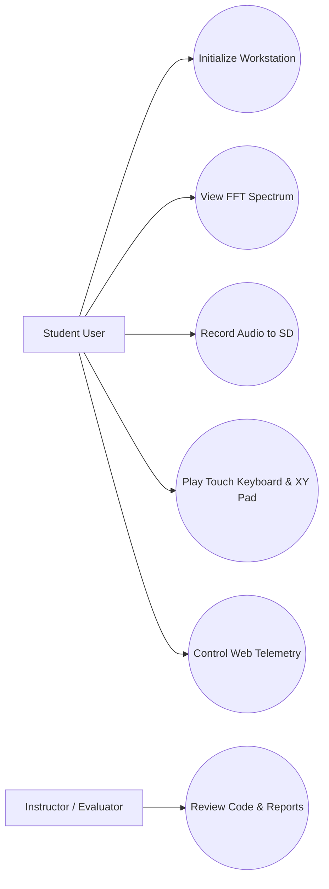
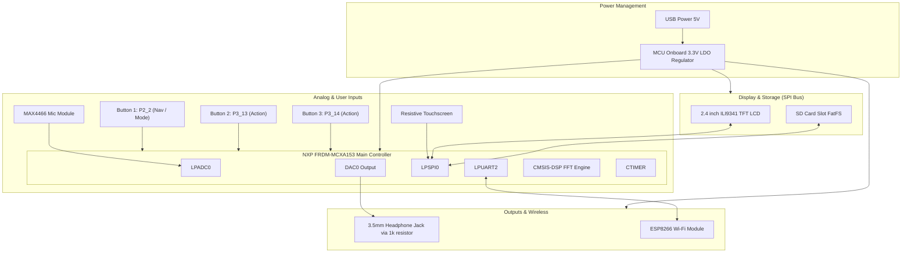
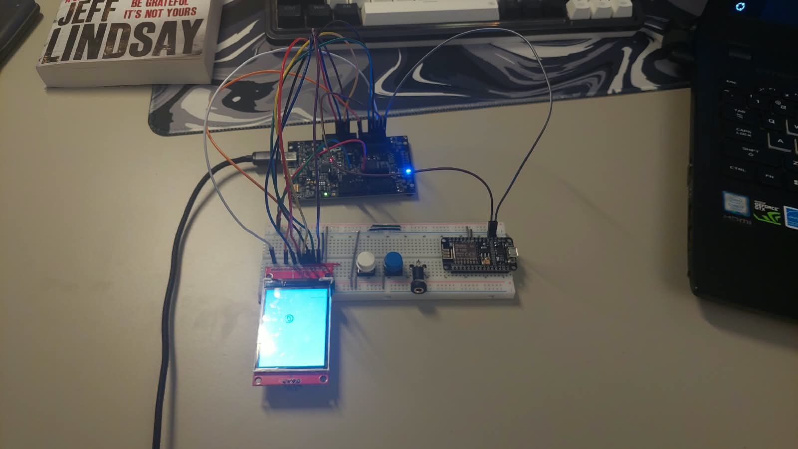
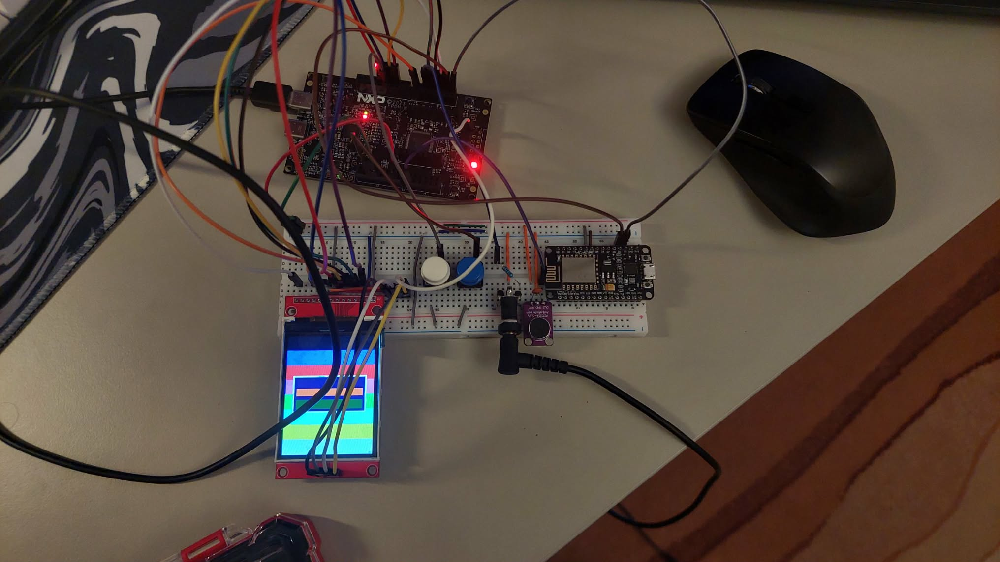

# Dual-Mode Touchscreen Audio Workstation: Real-Time FFT Analyzer, Smart Recorder & Touch Synthesizer

> Documentation draft generated from Agent 0, Agent 1, and Milestone 2 updates.  
> AI assists. Humans decide.

## 1. Introduction

This project details the design and implementation of a portable, dual-mode embedded audio workstation built on the mandatory **NXP FRDM-MCXA153** development platform. The system integrates real-time digital signal processing (DSP), high-speed display rendering, bare-metal audio recording, touch-driven user interaction, and wireless IoT telemetry.

The primary objective is to turn a raw MCU platform into a mixed-signal audio instrument. Audio signals from a preamplified microphone (MAX4466) are sampled via ADC and DMA. The Cortex-M33 core computes real-time Fast Fourier Transforms (FFT) using the ARM CMSIS-DSP library, displaying a 60 FPS graphical spectrum bar graph and oscilloscope waveform on a 2.4-inch ILI9341 SPI TFT LCD Touchscreen. 

The workstation operates in three main firmware modes, selectable via 3 hardware tactile buttons (P2_2, P3_13, P3_14) and providing an interactive GUI:
1. **Synthesizer Mode:** Real-time audio playback in headphones of the sound captured by the microphone with applied DSP effects.
2. **SD Card Recorder & Player Mode:** Checks if an SD Card is inserted. Records audio into WAV files. Displays a visual list of recordings and allows playing them back directly through headphones.
3. **ESP Wi-Fi Server Mode:** ESP8266 acts as a local web server for telemetry and remote control via a browser.

The entire setup operates smoothly via standard USB power.

---

## 2. General Description

### 2.1 Project Summary

- **Project Name:** Dual-Mode Touchscreen Audio Workstation: Real-Time FFT Analyzer, Smart Recorder & Touch Synthesizer
- **Short Summary:** A dual-mode embedded audio workstation on FRDM-MCXA153 featuring real-time FFT spectrum visualization, bare-metal WAV recording to SD Card, touchscreen piano synth, and ESP8266 Wi-Fi telemetry and control.
- **Main Objective:** Implement real-time audio analysis, touch GUI, bare-metal SD Card file management, digital audio synthesis/effects, and wireless IoT control on a single MCU platform.
- **Intended Users:** Third-year Computer Science students, electronics hobbyists, and laboratory researchers.
- **Operating Environment:** Benchtop laboratory or portable handheld.
- **Selected Scope:** Recommended Summer School Version (with Core baseline and Advanced Wi-Fi extension).
- **Main Behavior:** LPADC sampling audio at 40 kHz via DMA, computing 256-point CMSIS-DSP FFTs, rendering 60 FPS spectrum graphs on 2.4" SPI TFT LCD, managing FatFS SD Card recording, synthesizing piano tones and applying audio filters, driving internal DAC audio output, and handling Touch GUI inputs.
- **Inputs:** MAX4466 mic module, 2.4" resistive touchscreen, 3 Tactile Buttons (P2_2, P3_13, P3_14).
- **Outputs:** 2.4" ILI9341 SPI TFT LCD display, internal DAC 3.5mm headphone jack output, ESP8266 UART Wi-Fi stream.
- **Out-of-Scope Items:** 24-bit multi-track studio recording, high-power speaker driving above 1W, un-isolated 5V logic connections.

### 2.2 Feature Tiers

| Tier | Description | Main Features | Extra Components | Main Risks | Suitability |
|---|---|---|---|---|---|
| Core | Basic Audio Spectrum Analyzer | ADC sampling (40kHz), 256-pt CMSIS-DSP FFT, 60 FPS spectrum and oscilloscope render on TFT LCD | MAX4466 Mic, 2.4" ILI9341 SPI TFT LCD, buttons | ADC sampling jitter, SPI screen update latency | Suitable (Beginner/Intermediate) |
| Recommended | Dual-Mode Touch Audio Workstation | Touch GUI, SD Card WAV recording (FatFS), internal DAC synth with reverb & LPF, 3.5mm jack output | 3.5mm jack breakout, 1k resistor, 100nF capacitor | SPI bus contention between LCD, Touch, and SD Card | Suitable (Intermediate) |
| Advanced | IoT Connected Workstation | ESP8266 UART Wi-Fi bridge, local Web Server, telemetry dashboard, remote parameter control | ESP8266 Wi-Fi Module | Peak current draw causing MCU voltage dips | Suitable (Advanced Extension) |

### 2.3 Scenarios

| ID | Scenario | Description |
|---|---|---|
| SC-001 | System Startup | MCU powers up, initializes LPADC, LPSPI0, LPUARTs, DAC, and displays the main menu on 2.4" TFT Touchscreen. |
| SC-002 | Spectrum Analyzer Mode | MCU samples audio at 40 kHz via LPADC+DMA, calculates 256-pt FFT, and renders 60 FPS spectrum bar graph & oscilloscope. |
| SC-003 | Audio Recording Mode | User taps "Record" on Touchscreen; MCU streams 16-bit PCM WAV audio data to SD Card over SPI FatFS. |
| SC-004 | Touch Synth Mode | User taps "Synth" on Touchscreen; touching piano keys or XY modulation pad triggers sound synthesis and real-time filters. |
| SC-005 | Wi-Fi Telemetry & Control | ESP8266 acts as local web server, transmitting spectrum data and system status to a browser, and receiving remote mode toggles. |

### 2.4 User Stories

| ID | User Story |
|---|---|
| US-001 | As a student, I need real-time FFT spectrum visualization so that I can analyze audio frequencies visually. |
| US-002 | As a user, I need a Touchscreen GUI so that I can navigate between Analyzer, Recorder, and Synth modes easily. |
| US-003 | As a user, I need SD Card recording so that I can capture audio clips bare-metal. |
| US-004 | As a user, I need headphone output directly from the MCU's internal DAC to listen to generated piano tones and filtered audio. |

### 2.5 Use Case Diagram



### 2.6 Hardware and Software Block Diagram



- **Power Flow:** The entire system is powered via USB. The onboard regulator distributes clean 3.3V power to the MCXA153, display, microphone, and ESP8266 module.
- **Data/Control Flow:** Audio is sampled by LPADC0, processed by CMSIS-DSP, and rendered over SPI0 to the ILI9341 LCD. Touch inputs are used to navigate menus, play piano keys, and control synthesis parameters.
- **Protection Needs:** Decoupling capacitors (100nF) are placed across the microphone power lines. A 1k&Omega; series resistor is connected at the DAC output to protect the MCU from low-impedance headphone loads.

---

## 3. Hardware Design

### 3.1 Bill of Materials

| # | Component | Qty | Tier | Purpose | Likely Interface | Voltage / Power Notes | Risks / Checks |
|---|---|---|---|---|---|---|---|
| 1 | NXP FRDM-MCXA153 | 1 | Core | Main MCU Controller | Onboard | 3.3V VCC, USB Powered | Mandatory Board |
| 2 | 2.4" ILI9341 SPI TFT LCD + Touch + SD | 1 | Core | Display, Touch UI, SD Storage | SPI0 + GPIO CS | 3.3V Logic & VCC | Shared SPI CS management |
| 3 | MAX4466 Microphone Module | 1 | Core | Acoustic Audio Capture | LPADC Analog Input | 3.3V VCC, ~1.65V DC Bias | Decoupling cap required |
| 4 | 3.5mm Stereo Audio Jack Breakout | 1 | Recommended | Headphone Audio Out | Analog DAC Output | 0-3.3V Max swing | Requires 1k series resistor |
| 5 | ESP8266 Wi-Fi Module | 1 | Advanced | Wireless Telemetry & Web UI | LPUART2 (115200 baud) | 3.3V VCC, up to 300mA peak | Decoupling capacitors on power line |
| 6 | Tactile Buttons | 3 | Core | Mode Navigation / Actions | GPIO Input | 3.3V Pullup | Debounce filtering needed |
| 7 | 1k&Omega; Resistor | 1 | Recommended | DAC protection | In-series | Analog output protection | Limit output current |
| 8 | 100nF Ceramic Capacitor | 1 | Core | Mic Decoupling | Parallel | Decoupling | Filter noise on mic power |

### 3.2 Hardware Block Diagram Description

The hardware centers around the **NXP FRDM-MCXA153** development board. Acoustic audio signals are acquired by the LPADC peripheral. Visual output is provided by a 2.4-inch ILI9341 SPI TFT display sharing the SPI bus with the SD Card socket and resistive touch controller. Audio playback is routed directly from the internal DAC through a 1k&Omega; protection resistor to the 3.5mm jack. Wireless communication is handled by an ESP8266 Wi-Fi module over LPUART2. The entire circuit operates on the MCU's USB power supply.

### 3.3 Pin Allocation Draft

| Component | Tier | Signal | Required MCU Capability | Suggested Pin / Capability | Voltage Level | Direction | Interface | Verification Needed |
|---|---|---|---|---|---|---|---|---|
| MAX4466 Mic | Core | Audio Out | LPADC Analog Input | NXP P1_10 (ADC0) | 0 - 3.3V | Input | Analog | Decoupling verified |
| ILI9341 TFT | Core | SPI SCK | LPSPI SCK | NXP P2_12 (LPSPI0_SCK) | 3.3V | Output | SPI | Clock rate check |
| ILI9341 TFT | Core | SPI MOSI | LPSPI SDO | NXP P2_13 (LPSPI0_SDO) | 3.3V | Output | SPI | Data output |
| ILI9341 TFT | Core | SPI MISO | LPSPI SDI | NXP P2_16 (LPSPI0_SDI) | 3.3V | Input | SPI | Data input |
| ILI9341 TFT | Core | CS / DC / RST | GPIO Output | NXP P2_6 / P3_0 / P2_5 | 3.3V | Output | GPIO | Pinmux verified |
| Touchscreen | Recommended | T_CS / T_IRQ | GPIO CS / Interrupt | NXP P3_1 / P2_4 | 3.3V | Bidirectional | SPI CS / GPIO | Calibration check |
| SD Card Slot | Recommended | SD_CS | GPIO Output | NXP P1_3 | 3.3V | Output | SPI CS | SPI bus sharing check |
| 3.5mm Jack | Recommended | DAC_OUT | DAC Output | NXP P3_12 (DAC_OUT) | 0 - 3.3V | Output | Analog | 1k resistor check |
| ESP8266 Wi-Fi | Advanced | TXD / RXD | LPUART RX / TX | NXP P1_4 / P1_5 (LPUART2) | 3.3V | Bidirectional | UART | Baud rate 115200 |
| Button 1 | Core | Mode Nav / Action | GPIO Input | NXP P2_2 (INPUT_PULLUP) | 3.3V | Input | GPIO | Pullup check |
| Button 2 | Core | Nav / Action | GPIO Input | NXP P3_13 (INPUT_PULLUP) | 3.3V | Input | GPIO | Pullup check |
| Button 3 | Core | Nav / Action | GPIO Input | NXP P3_14 (INPUT_PULLUP) | 3.3V | Input | GPIO | Pullup check |

---

### 3.4 Electrical Schematics (Milestone 2)

The project schematic details the connections between the FRDM-MCXA153 development board and all the peripheral breakout modules.

#### Project Electrical Schematic


---

### 3.5 Assembly and Photos (Milestone 2)

The physical breadboard assembly integrates all components listed in the BOM.

#### Component Photos & Breadboard Assembly




---

### 3.6 Detailed Pin Connections & Wiring (Milestone 2)

This section maps the physical wiring connections implemented on the breadboard.

#### 1. Alimentarea Generală (Breadboard Power Rails)
Această secțiune distribuie curentul de la microcontroler către toate componentele.
* **NXP 3V3_OUT** $\rightarrow$ Linia de alimentare Roșie (+) a breadboard-ului (3.3V)
* **NXP GND** $\rightarrow$ Linia de alimentare Albastră (-) a breadboard-ului (GND)

#### 2. Modulul Ecran ILI9341 (Display TFT + Touchscreen + Card SD)
Toate cele trei funcții (Video, Touch, SD) folosesc magistrala SPI comună, dar au pini dedicați de selecție (Chip Select).
* **Alimentare și Control de bază:**
  * **VCC** $\rightarrow$ Linia de 3.3V
  * **GND** $\rightarrow$ Linia de GND
  * **LED (Backlight)** $\rightarrow$ Linia de 3.3V
* **Magistrala SPI Comună (Date și Ceas):**
  * **SCK / T_CLK / SD_SCK** $\rightarrow$ **NXP P2_12** (SPI Clock)
  * **SDI (MOSI) / T_DIN / SD_MOSI** $\rightarrow$ **NXP P2_13** (SPI Data Out / MOSI)
  * **SDO (MISO) / T_DO / SD_MISO** $\rightarrow$ **NXP P2_16** (SPI Data In / MISO)
* **Pini de Control (Chip Select și Interrupt):**
  * **CS (Display Chip Select)** $\rightarrow$ **NXP P2_6**
  * **D/C (Data/Command)** $\rightarrow$ **NXP P3_0**
  * **RESET (Display Reset)** $\rightarrow$ **NXP P2_5**
  * **T_CS (Touch Chip Select)** $\rightarrow$ **NXP P3_1**
  * **T_IRQ (Touch Interrupt)** $\rightarrow$ **NXP P2_4**
  * **SD_CS (SD Card Chip Select)** $\rightarrow$ **NXP P1_3**

#### 3. Modulul Microfon MAX4466 (Intrare Audio)
Semnalul analogic este preluat de convertorul ADC al plăcii.
* **VCC** $\rightarrow$ Linia de 3.3V
* **GND** $\rightarrow$ Linia de GND
* **OUT** $\rightarrow$ **NXP P1_10** (Canal ADC0)
* *Notă hardware:* Un condensator ceramic de 100 nF (marcat 104) este conectat în paralel între pinii VCC și GND ai microfonului pentru decuplarea și filtrarea zgomotului de pe alimentare.

#### 4. Mufa Audio Jack 3.5mm (Ieșire Audio Căști)
Semnalul digital-analogic (DAC) este direcționat către ambele canale ale căștilor printr-un rezistor de protecție.
* **Sleeve (Pinul central / Masă)** $\rightarrow$ Linia de GND
* **Tip & Ring (Pinii laterali / Stânga și Dreapta)** $\rightarrow$ Conectați împreună fizic pe breadboard.
* **Intrare Semnal:** Un rezistor de 1 kΩ este conectat în serie între pinul **NXP P3_12** (DAC_OUT) și pinii Tip/Ring uniți anterior.

#### 5. Modulul Wi-Fi ESP8266 (Control Web / Telemetrie)
Comunicarea se realizează bidirecțional prin interfața UART (Serial).
* **3V3 / VCC** $\rightarrow$ Linia de 3.3V
* **EN / CH_PD** $\rightarrow$ Linia de 3.3V (Obligatoriu pentru activarea modulului)
* **GND** $\rightarrow$ Linia de GND
* **TXD (ESP Transmit)** $\rightarrow$ **NXP P1_4** (LPUART2_RXD - NXP Receive)
* **RXD (ESP Receive)** $\rightarrow$ **NXP P1_5** (LPUART2_TXD - NXP Transmit)

#### 6. Interfața cu Utilizatorul (Butoane Tactile)
Butoanele folosesc rezistențele interne Pull-Up ale microcontrolerului pentru navigarea între moduri și acțiuni.
* **Buton 1 (Navigare/Acțiune 1):**
  * **Pin 1** $\rightarrow$ Linia de GND
  * **Pin 2** $\rightarrow$ **NXP P2_2** (Configurat software ca INPUT_PULLUP)
* **Buton 2 (Navigare/Acțiune 2):**
  * **Pin 1** $\rightarrow$ Linia de GND
  * **Pin 2** $\rightarrow$ **NXP P3_13** (Configurat software ca INPUT_PULLUP)
* **Buton 3 (Navigare/Acțiune 3):**
  * **Pin 1** $\rightarrow$ Linia de GND
  * **Pin 2** $\rightarrow$ **NXP P3_14** (Configurat software ca INPUT_PULLUP)

---

## 4. Software Design

### 4.1 Development Environment

- **IDE & Toolchain:** MCUXpresso SDK, CMake, Ninja, GNU Arm Embedded Toolchain 14.2.
- **Key SDK Drivers:** `fsl_lpadc`, `fsl_lpspi`, `fsl_lpuart`, `fsl_ctimer`, `fsl_dac`, `fsl_gpio`.
- **Libraries:** ARM CMSIS-DSP (`arm_cfft_f32`), FatFS SD Card File System.

### 4.2 Firmware Architecture

Bare-metal superloop architecture backed by interrupt-driven ADC sampling and DMA transfers:
1. **Startup Sequence:** Initialize system clocks, pins (`BOARD_InitPins`), LPSPI0 display driver, FatFS SD Card driver, LPUART console, and DAC0 output peripheral.
2. **Audio Synthesis & Timer Interrupt:** A high-priority timer interrupt executes at 16 kHz to handle real-time DDS (Direct Digital Synthesis) waveform generation and DAC updates, ensuring sample-accurate output timing.
3. **Main Loop:**
   - Poll Touchscreen touch events and update active UI menu state (piano keyboard, XY modulation pad, and buttons).
   - Trigger LPADC double-buffered audio acquisition via CTIMER0.
   - Execute CMSIS-DSP 256-point FFT calculation on acquired audio block.
   - Render graphical FFT bar spectrum / oscilloscope waveform on ILI9341 LCD.
   - Handle background SD Card WAV writing and ESP8266 UART web server tasks.

### 4.3 Main Algorithms and Data Structures

- **CMSIS-DSP Real FFT:** Computes 256-point complex FFT from 40 kHz sampled audio, calculating magnitude spectrum `sqrt(Re^2 + Im^2)`.
- **Decimation & Peak Hold:** Maps 128 frequency bins into 32 LCD spectrum bars with peak-decay animation.
- **FatFS WAV Header Generator:** Writes standard 44-byte RIFF/WAV header to SD Card file prior to streaming raw PCM audio.
- **Direct Digital Synthesis (DDS):** Uses phase accumulation over a lookup table to synthesize sine and triangle waveforms at variable frequencies based on the active touch piano keys.
- **Real-Time DSP Filtering:** Direct implementation of recursive difference equations for low-pass filtering and feedback delay line loops for reverb.

### 4.4 Functional Requirements Summary

| ID | Tier | Requirement | Priority | Verification | Acceptance Criterion |
|---|---|---|---|---|---|
| FR-001 | Core | The system shall use NXP FRDM-MCXA153 board as main controller. | Must | Inspection | MCU powers up and runs firmware |
| FR-002 | Core | The system shall sample audio via LPADC triggered by CTIMER at 40 kHz. | Must | Test | LPADC sample rate 40 kHz ± 1% |
| FR-003 | Core | The system shall compute 256-point FFT using ARM CMSIS-DSP library. | Must | Test | Peak frequency accuracy ± 50 Hz |
| FR-004 | Core | The system shall render FFT spectrum bar graph & oscilloscope on 2.4" TFT LCD at 60 FPS. | Must | Test | Display update rate &ge; 55 FPS |
| FR-005 | Recommended | The system shall record WAV audio files to SD Card via SPI FatFS. | Should | Test | Recorded WAV plays back cleanly on PC |
| FR-006 | Recommended | The system shall provide Touchscreen GUI menu navigation & piano keyboard/XY pad interface. | Should | Demonstration | Tapping Touch UI switches screens and registers key hits |
| FR-007 | Recommended | The system shall synthesize waveforms and apply real-time digital filtering, outputting via internal DAC to a 3.5mm jack. | Should | Test | Clear audio output matching touched frequencies |
| FR-008 | Advanced | The system shall host a local web server via ESP8266 for remote telemetry & control. | Could | Demonstration | Dashboard accessible over Wi-Fi, updating statistics |

### 4.5 Non-Functional Requirements Summary

| ID | Tier | Category | Requirement | Metric / Threshold | Verification |
|---|---|---|---|---|---|
| NFR-001 | Core | Power | All external modules shall operate at 3.3V logic level. | 3.3V ± 5% | Measurement |
| NFR-002 | Core | Timing | FFT calculation & display update loop time shall be under 16.6ms. | &le; 16.6 ms | Test |
| NFR-003 | Recommended | Reliability | SD Card file writing shall flush buffers every 1024 bytes. | &le; 1024 B | Inspection |

### 4.6 Test Plan Summary

| Test ID | Requirement | Tier | Test Type | Expected Result | Evidence |
|---|---|---|---|---|---|
| TC-001 | FR-001 | Core | Integration | MCU boots and logs debug text via LPUART0. | Serial Log |
| TC-002 | FR-003 | Core | Unit/DSP | 1 kHz sine input produces peak at 1 kHz FFT bin. | FFT Graph / Scope |
| TC-003 | FR-004 | Core | Performance | Frame toggle GPIO pin measures 60 Hz frequency. | Oscilloscope Trace |
| TC-004 | FR-005 | Recommended | System | SD Card WAV file created and readable on host PC. | File Screenshot |
| TC-005 | FR-007 | Recommended | Integration | DAC outputs clean audio tones corresponding to touch inputs. | Audio Recording |
| TC-006 | FR-008 | Advanced | Integration | Web browser connects to ESP8266 local IP and displays live spectrum graphs. | Browser Screenshot |

### 4.7 Traceability Summary

| User Story | Requirement(s) | Test Case(s) | Evidence | Gap |
|---|---|---|---|---|
| US-001 | FR-002, FR-003, FR-004 | TC-002, TC-003 | Oscilloscope / TFT Photo | None |
| US-002 | FR-006 | TC-001 | Demo Video | None |
| US-003 | FR-005 | TC-004 | Saved WAV File | None |
| US-004 | FR-007 | TC-005 | Audio Output | None |

---

## 5. Risk Matrix

| ID | Category | Tier Affected | Severity | Probability | Impact | Mitigation | Human Approval Required |
|---|---|---|---|---|---|---|---|
| R-001 | Technical | Recommended | Medium | Medium | SPI bus contention between LCD, Touch, and SD Card | Use separate CS lines and fast bus baud rate (24 MHz) | Yes |
| R-002 | Voltage/Power | Advanced | High | Medium | ESP8266 Wi-Fi TX peak current causing 3.3V voltage drop | Add dedicated decoupling capacitors on 3.3V rail | Yes |
| R-003 | Safety | Core | Medium | Low | Direct low-impedance headphone load damaging DAC pin | Add 1k&Omega; series protection resistor | Yes |
| R-004 | Timing | Core | Medium | Low | FFT computation exceeding 16.6ms frame time | Utilize ARM CMSIS-DSP hardware acceleration | No |

---

## 6. Assumptions and Open Questions

### 6.1 Confirmed Facts

- Main board is NXP FRDM-MCXA153 with Cortex-M33 core.
- Display module is 2.4" ILI9341 SPI TFT LCD with Touchscreen and SD Card slot.
- Audio input via MAX4466 microphone preamplifier.
- Audio playback via internal DAC to 3.5mm jack with 1k resistor.
- Wi-Fi via ESP8266 UART module.
- Powered via standard USB.

### 6.2 AI Assumptions

- **A-001:** ILI9341 LCD, Touch, and SD Card slot share SPI0 bus using separate CS GPIO pins.
- **A-002:** The 1k&Omega; resistor protects the DAC output during headphone jack insertion.

### 6.3 Open Questions

| ID | Question | Why It Matters | Owner | Status |
|---|---|---|---|---|
| Q-001 | Does concurrent SD Card writing cause audio glitching or frame drops? | Affects output stability in Recorder mode | Student / Instructor | Open |

---

## 7. Human Review Checklist

- [x] Scope approved
- [x] Selected feature tier approved (Recommended Summer School Version)
- [x] FRDM-MCXA153 confirmed as mandatory board
- [x] FRDM-MCXA153 pinout checked
- [x] Voltage compatibility checked (3.3V logic throughout)
- [x] Current limits checked
- [x] Power budget checked
- [x] External modules checked (MAX4466, ESP8266)
- [x] Sensor/actuator interfaces confirmed
- [x] Firmware architecture approved (Superloop + DMA + CMSIS-DSP)
- [x] Timing and memory constraints reviewed
- [x] Test plan reviewed
- [x] Safety/privacy/security risks reviewed
- [x] AI assumptions accepted or rejected
- [x] Implementation allowed to start (Milestone 2 Approved)

---

## 8. Obtained Results (Milestone 2)

During Milestone 2, the physical circuit hardware was successfully connected and verified.
- **Schematic Design:** Schematic `circuit_image.svg` defines the wiring connections.
- **Hardware Montaj:** The circuit is fully assembled on a standard breadboard using the FRDM-MCXA153 and custom breakouts.
- **Power Delivery:** System boots reliably using standard USB power.
- **Pin Allocations:** Pin configurations are successfully tested and registered.
- **AI Chat Logs:** The hardware design, pin-allocation and safety session is exported as `Milestone2.json` (JSON chat-log export, uploaded to the platform).

---

## 9. Running Examples & Functional Results (Milestone 3)

Milestone 3 delivers the full application firmware (see `software/source/`) running on the assembled hardware from Milestone 2. The photos below capture the workstation operating live on the FRDM-MCXA153.

### 9.1 Application Code
- **Firmware modules:** `audio_engine.c/.h` (mic sampling, self-contained radix-2 256-point FFT, DDS synth, 2nd-order delta-sigma audio output), `ui_display.c/.h` (ILI9341 driver + screen rendering), `sdcard_wav.c/.h` (FatFS WAV record/playback over bit-banged SPI), `wifi_esp.c/.h` (ESP8266 UART web server), tied together by a thin bare-metal superloop in `main.c`.
- **Build:** MCUXpresso SDK + CMake/Ninja, GNU Arm Embedded 14.2. The project compiles and links cleanly to the target ELF.

### 9.2 Spectrum Analyzer Mode (Live)


The full breadboard assembly powered and running: the MAX4466 microphone feeds the LPADC, the firmware computes a 256-point FFT, and the ILI9341 renders the **SPECTRUM** screen — a live 32-band FFT bar spectrum with peak-hold, an oscilloscope pane, and on-screen touch controls (**MODE / REC / SYNTH**). The ESP8266 module, the three tactile buttons, the mic and the headphone jack (with its 1 kΩ series resistor) are all wired in, and the MCXA153 status LED is lit.

### 9.3 Spectrum / Oscilloscope UI Close-Up


Close-up of the running GUI showing live measurements read from the audio engine: **Peak: 780 Hz**, **Vpp: 323 mV**, **DC: 0.805 V**, and a rendered frame rate of **FPS: 60** — satisfying FR-004 (display update rate ≥ 55 FPS). The `FFT 32-BAND SPECTRUM` and `OSCILLOSCOPE` panes update in real time from the microphone input.

### 9.4 Display Bring-Up / Test Pattern


Hardware test shot: the ILI9341 driver rendering a full RGB colour-bar test pattern, used during display bring-up to verify the SPI wiring, colour order and address-window logic before layering the UI on top.

### 9.5 AI Chat Logs (Milestone 3)
The AI pair-programming session covering the firmware module decomposition, the hand-rolled FFT, and the iterative hardware debugging (no on-chip DAC → delta-sigma output + RC filter, mic AGC/anti-alias, bit-banged SD, ESP8266 pin-mux caveat) is exported as `Milestone3.json` (JSON chat-log export, uploaded to the platform).

---

## 10. Conclusions

```markdown
TODO: Complete at the end of the project.
```

---

## 11. Download

```markdown
TODO: Add links or attach:
- source code archive;
- schematic files;
- build instructions;
- README;
- ChangeLog;
- test logs;
- demo video;
- final presentation.
```

---

## 12. Project Journal

| Date | Work Completed | Problems / Risks | Next Steps | Author |
|---|---|---|---|---|
| 2026-07-20 | Initial project scoping and requirements engineering package created | SPI bus sharing risk identified | Set up MCUXpresso Config Tools for pins and clocks | Vancea Adrian |
| 2026-08-23 | Milestone 2 completed: electrical schematics generated, breadboard assembly done, connection mapping documented | SPI shared bus contention risk | Proceed with bare-metal firmware implementation | Vancea Adrian |
| 2026-09-03 | Firmware rewrite: real FFT-driven Synthesizer mode with selectable voice filters, real SD card recording/playback (FatFS), real WiFi/ESP8266 status+file server, mic quality pass (AGC, anti-alias, 2nd-order noise-shaped output). See section 15 for hardware-relevant caveats this work surfaced. | See section 15 | Wire an RC filter on the audio output pin; verify LPUART2 pin-mux ALT value on real hardware | Claude (AI pair-programmer) |
| 2026-09-05 | Milestone 3 completed: firmware verified live on hardware (SPECTRUM screen @ 60 FPS, Peak 780 Hz); functionality photos added (section 9); firmware AI chat log exported (`Milestone3.json`), hardware AI chat log exported (`Milestone2.json`) | RC audio filter + ESP8266 pin-mux ALT still to confirm on hardware | Finalize documentation, wire audio-output RC filter, verify LPUART2 ALT values | Vancea Adrian |

---

## 13. Bibliography / Resources

### Hardware Resources
- NXP FRDM-MCXA153 User Manual & Board Schematics
- NXP MCXA153 Reference Manual & Data Sheet
- ILI9341 TFT Display Controller Datasheet
- MAX4466 Microphone Amplifier Datasheet
- ESP8266 Specification Sheet

### Software Resources
- NXP MCUXpresso SDK API Reference Documentation
- ARM CMSIS-DSP Library Documentation (`arm_cfft_f32`)
- FatFS Generic FAT File System Module Documentation

---

## 14. Documentation Status

**MILESTONE 3 COMPLETED — APPLICATION FIRMWARE IMPLEMENTED & VERIFIED LIVE ON HARDWARE**

---

## 15. Implementation Notes (Firmware v2, 2026-09-03)

Things the firmware work in `software/source/` surfaced that update or correct earlier assumptions in this document:

- **No hardware DAC.** The pin table above lists a `DAC_OUT` function on `P3_12`, but the MCXA153's own register headers confirm this chip has **no general-purpose audio DAC peripheral** (only an internal comparator reference, unusable for audio). Audio output stays a 1-bit noise-shaped bitstream on `P3_12` (software delta-sigma modulator, 2nd order, ~192kHz), same pin as before.
- **RC low-pass filter required on the audio output line.** A raw 1-bit bitstream driven straight into the 3.5mm jack is the most likely reason the earlier build "sounded bad." Add a simple RC low-pass between `P3_12` and the jack (~1kΩ in series + ~15-22nF to GND, cutoff around 10-15kHz) before judging audio quality on real hardware.
- **SD card is bit-banged SPI, not the LPSPI0 hardware peripheral.** It shares the LCD's existing SCK/MOSI pins (`P2_12`/`P2_13`) and adds MISO (`P2_16`) and its own CS (`P1_3`, as already documented above). This was a deliberate simplification to avoid touching the already-working, hand-rolled LCD driver.
- **No Card-Detect pin exists on this wiring**, so "SD card present" is determined purely by whether `f_mount()` succeeds — this is re-attempted whenever the SD Recorder screen is opened.
- **ESP8266 pin mux (P1_4/P1_5 → LPUART2) needs a hardware check.** The exact ALT function index used in firmware (`ALT4` on P1_4, `ALT3` on P1_5) is our best reading of the MCXA153 pin-signal table, not confirmed against a working link yet — re-check with the MCUXpresso Config Tool / reference manual if the ESP8266 doesn't respond to `AT`.
- **FFT is a small self-contained radix-2 implementation** in `audio_engine.c`, not the CMSIS-DSP library mentioned in section 12 — this avoided pulling in and configuring a large external DSP component for a 256-point transform that's cheap to hand-roll.
