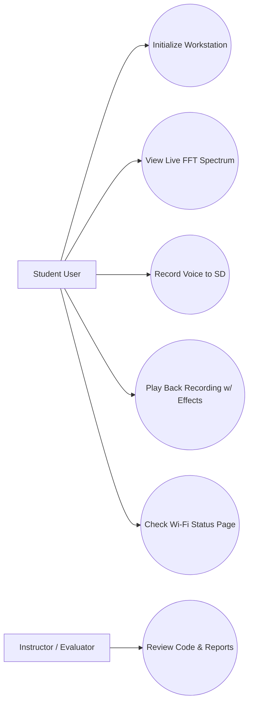

# Voice Synthesizer, SD Recorder & Wi-Fi Audio Workstation (FRDM-MCXA153)

> Documentation draft generated from Agent 0, Agent 1, and Milestone 2 updates.
> AI assists. Humans decide.

## 1. Introduction

This project details the design and implementation of a portable, three-mode embedded audio workstation built on the mandatory **NXP FRDM-MCXA153** development platform. The system integrates real-time digital signal processing (DSP), bare-metal SD card file handling, and a wireless local web server, navigated entirely through 3 hardware tactile buttons (the LCD module's resistive touch controller is present on the display hardware but is **not** wired up or used by the firmware).

The primary objective is to turn a raw MCU platform into a voice-processing instrument. Audio is sampled from a preamplified microphone (MAX4466) via the LPADC peripheral, timed by a SysTick-derived 16kHz trigger. The Cortex-M33 core computes a real-time 256-point Fast Fourier Transform using a small self-contained implementation (no external DSP library), rendering a frequency spectrum bar graph with peak-hold on a 2.4-inch ILI9341 SPI TFT LCD.

The workstation operates in three main firmware modes, selectable via 3 hardware tactile buttons (P2_2, P3_13, P3_14):
1. **Synthesizer Mode:** Real-time playback in headphones of the sound captured by the microphone, with a selectable voice effect (warm low-pass, "phone" high-pass, or ring-modulated "robot"), alongside a live FFT spectrum display.
2. **SD Card Recorder & Player Mode:** Checks whether an SD Card is actually mounted — recording is only possible with a real, detected card. Records audio into WAV files, lists recordings on-screen, and plays them back through headphones (applying the same voice effects during playback is a planned next step, not yet wired in — see section 14).
3. **ESP Wi-Fi Server Mode:** ESP8266 acts as a local Wi-Fi access point + a small web server, serving live voice level/spectrum status and a list of recordings; serving the recorded WAV files themselves over Wi-Fi is implemented but may not be practical for larger files given the ESP8266 AT-command link's throughput.

There is no hardware audio DAC on this MCU (confirmed against the vendor register headers) — headphone output is a software-generated 1-bit pulse-density bitstream on a GPIO pin, cleaned up by an external RC low-pass filter before reaching the 3.5mm jack.

The entire setup operates smoothly via standard USB power.

---

## 2. General Description

### 2.1 Project Summary

- **Project Name:** Voice Synthesizer, SD Recorder & Wi-Fi Audio Workstation
- **Short Summary:** A three-mode embedded audio workstation on FRDM-MCXA153: a live voice synthesizer with real-time FFT spectrum display and selectable voice effects, an SD-card WAV recorder/player gated on real card detection, and an ESP8266 Wi-Fi server exposing live status and recordings — all navigated with 3 buttons, all audio heard through a 3.5mm headphone jack driven by a software PDM signal (this MCU has no hardware DAC).
- **Main Objective:** Implement real-time voice capture and effects, live FFT visualization, bare-metal SD card file management, button-driven UI, and a wireless local web server on a single MCU platform.
- **Intended Users:** Third-year Computer Science students, electronics hobbyists, and laboratory researchers.
- **Operating Environment:** Benchtop laboratory or portable handheld.
- **Selected Scope:** Recommended Summer School Version (with Core baseline and Advanced Wi-Fi extension).
- **Main Behavior:** LPADC sampling audio at 16 kHz (SysTick-timed), computing a 256-point FFT in software, rendering a spectrum bar graph on the 2.4" SPI TFT LCD, managing FatFS SD Card recording/playback, applying selectable voice effects, driving a software PDM headphone output, and handling 3-button UI input.
- **Inputs:** MAX4466 mic module, 3 Tactile Buttons (P2_2, P3_13, P3_14).
- **Outputs:** 2.4" ILI9341 SPI TFT LCD display, software-PDM 3.5mm headphone jack output (RC-filtered, no hardware DAC), ESP8266 UART Wi-Fi stream.
- **Out-of-Scope Items:** 24-bit multi-track studio recording, high-power speaker driving above 1W, un-isolated 5V logic connections, touchscreen-driven interaction (hardware present, not used by firmware).

### 2.2 Feature Tiers

| Tier | Description | Main Features | Extra Components | Main Risks | Suitability |
|---|---|---|---|---|---|
| Core | Voice Synthesizer with Live FFT | LPADC sampling (16kHz), 256-pt self-contained FFT, dB-scaled spectrum bar render with peak-hold on TFT LCD, selectable voice effects, headphone monitoring | MAX4466 Mic, 2.4" ILI9341 SPI TFT LCD, buttons, RC output filter | ADC/output timing must stay ISR-driven so LCD drawing can never stall audio; a 1-bit PDM output needs real analog filtering to sound clean | Suitable (Beginner/Intermediate) |
| Recommended | SD Card Recorder & Player | SD card mount-gated recording, WAV files via FatFS, on-screen file browser, playback through headphones | 3.5mm jack breakout, 1k resistor, ceramic capacitor (RC filter) | Bit-banged SPI shared with the LCD bus; no card-detect pin, so "present" = mount succeeded | Suitable (Intermediate) |
| Advanced | ESP8266 Wi-Fi Server | ESP8266 AT-command driver, SoftAP + small HTTP server, live status/FFT JSON, file listing, file download | ESP8266 Wi-Fi Module | Peak current draw causing MCU voltage dips; large file downloads may be impractical over the AT-command UART link | Suitable (Advanced Extension) |

### 2.3 Scenarios

| ID | Scenario | Description |
|---|---|---|
| SC-001 | System Startup | MCU powers up, initializes LPADC, LPSPI/bit-banged SPI, LPUART2, and displays the Synthesizer screen by default. |
| SC-002 | Synthesizer Mode | MCU samples mic audio at 16 kHz, computes a 256-pt FFT, renders a spectrum bar graph with peak-hold, and plays the (optionally effected) live signal through headphones. |
| SC-003 | SD Recording | User presses REC in SD Recorder mode; if a card is mounted, MCU streams 16-bit PCM WAV audio to the SD Card over bit-banged SPI + FatFS. If no card is mounted, recording is refused. |
| SC-004 | SD Playback | User presses PLAY in SD Recorder mode; MCU streams a recorded WAV file back from the SD card through headphones. |
| SC-005 | Wi-Fi Telemetry | ESP8266 acts as a SoftAP + local web server, serving live status/spectrum data and a recordings list to a browser; individual recordings can be downloaded, bandwidth permitting. |

### 2.4 User Stories

| ID | User Story |
|---|---|
| US-001 | As a student, I need real-time FFT spectrum visualization so that I can analyze my voice's frequencies visually while I speak. |
| US-002 | As a user, I need simple button navigation so that I can switch between Synthesizer, SD Recorder, and Wi-Fi Server modes easily. |
| US-003 | As a user, I need SD Card recording, gated on a real card being present, so that I can capture voice clips bare-metal. |
| US-004 | As a user, I need headphone output so that I can hear my own voice live, with optional effects, and hear back what I've recorded. |

### 2.5 Use Case Diagram



### 2.6 Hardware and Software Block Diagram

```mermaid
flowchart TD
    subgraph PowerSystem["Power Management"]
        USB[USB Power 5V] --> REG[MCU Onboard 3.3V LDO Regulator]
    end

    subgraph MCUCore["NXP FRDM-MCXA153 Main Controller"]
        ADC[LPADC0]
        PDM[SysTick Software PDM Output]
        SPI[Bit-Banged SPI]
        UART2[LPUART2]
        FFT[Self-Contained 256-pt FFT]
    end

    subgraph Inputs["Analog & User Inputs"]
        MIC[MAX4466 Mic Module] --> ADC
        BTN1[Button 1: P2_2 (Mode)] --> MCUCore
        BTN2[Button 2: P3_13 (Action 1)] --> MCUCore
        BTN3[Button 3: P3_14 (Action 2)] --> MCUCore
    end

    subgraph DisplayStorage["Display & Storage (shared SPI bus)"]
        TFT[2.4 inch ILI9341 TFT LCD] <--> SPI
        SD[SD Card Slot FatFS] <--> SPI
    end

    subgraph OutputsComms["Outputs & Wireless"]
        PDM --> RC[RC Low-Pass Filter] --> JACK[3.5mm Headphone Jack]
        UART2 <--> ESP[ESP8266 Wi-Fi Module]
    end

    REG --> MCUCore
    REG --> DisplayStorage
    REG --> OutputsComms
```

- **Power Flow:** The entire system is powered via USB. The onboard regulator distributes clean 3.3V power to the MCXA153, display, microphone, and ESP8266 module.
- **Data/Control Flow:** Audio is sampled by LPADC0 on a SysTick-derived timer, processed and FFT'd in software, and rendered over bit-banged SPI to the ILI9341 LCD. Buttons are used to switch modes and trigger REC/PLAY/filter actions.
- **Protection Needs:** A decoupling capacitor (100nF) is placed across the microphone power lines. Since there is no hardware DAC, the audio-out GPIO pin needs an external RC low-pass filter (not just a series resistor) to turn its 1-bit bitstream into a listenable analog signal.

---

## 3. Hardware Design

### 3.1 Bill of Materials

| # | Component | Qty | Tier | Purpose | Likely Interface | Voltage / Power Notes | Risks / Checks |
|---|---|---|---|---|---|---|---|
| 1 | NXP FRDM-MCXA153 | 1 | Core | Main MCU Controller | Onboard | 3.3V VCC, USB Powered | Mandatory Board |
| 2 | 2.4" ILI9341 SPI TFT LCD + Touch + SD | 1 | Core | Display, SD Storage (touch controller present on the module but unused by firmware) | Bit-banged SPI + GPIO CS | 3.3V Logic & VCC | Shared SPI CS management |
| 3 | MAX4466 Microphone Module | 1 | Core | Acoustic Audio Capture | LPADC Analog Input | 3.3V VCC, ~1.65V DC Bias | Decoupling cap required |
| 4 | 3.5mm Stereo Audio Jack Breakout | 1 | Recommended | Headphone Audio Out | Software PDM (GPIO) + RC filter | 0-3.3V swing, filtered | No DAC on this MCU — needs a real RC low-pass, not just a resistor |
| 5 | ESP8266 Wi-Fi Module | 1 | Advanced | Wireless Telemetry & Web UI | LPUART2 (115200 baud) | 3.3V VCC, up to 300mA peak | Decoupling capacitors on power line |
| 6 | Tactile Buttons | 3 | Core | Mode Navigation / Actions | GPIO Input | 3.3V Pullup | Debounce filtering needed |
| 7 | 1kΩ Resistor | 1 | Recommended | PDM output RC filter (series element) | In-series | Forms low-pass with capacitor below | Alone, does not filter anything |
| 8 | 100nF Ceramic Capacitor | 2 | Core | Mic decoupling (1) + PDM output RC filter to GND (1) | Parallel | Decoupling / filtering | Needed on both mic power and audio output |

### 3.2 Hardware Block Diagram Description

The hardware centers around the **NXP FRDM-MCXA153** development board. Acoustic audio signals are acquired by the LPADC peripheral. Visual output is provided by a 2.4-inch ILI9341 SPI TFT display sharing a bit-banged SPI bus with the SD Card socket (the module's resistive touch controller is present but not wired into firmware). Audio playback is a software-generated 1-bit PDM bitstream on a GPIO pin, cleaned up by an external RC low-pass filter (resistor + capacitor) before reaching the 3.5mm jack — this MCU has no hardware audio DAC. Wireless communication is handled by an ESP8266 Wi-Fi module over LPUART2. The entire circuit operates on the MCU's USB power supply.

### 3.3 Pin Allocation Draft

| Component | Tier | Signal | Required MCU Capability | Suggested Pin / Capability | Voltage Level | Direction | Interface | Verification Needed |
|---|---|---|---|---|---|---|---|---|
| MAX4466 Mic | Core | Audio Out | LPADC Analog Input | NXP P1_10 (ADC0, channel 8) | 0 - 3.3V | Input | Analog | Decoupling verified |
| ILI9341 TFT | Core | SPI SCK | Bit-banged GPIO | NXP P2_12 | 3.3V | Output | SPI (bit-banged) | Clock rate check |
| ILI9341 TFT | Core | SPI MOSI | Bit-banged GPIO | NXP P2_13 | 3.3V | Output | SPI (bit-banged) | Data output |
| SD Card Slot | Recommended | SPI MISO | Bit-banged GPIO (input) | NXP P2_16 | 3.3V | Input | SPI (bit-banged) | Needed for SD reads, LCD is write-only |
| ILI9341 TFT | Core | CS / DC / RST | GPIO Output | NXP P2_6 / P3_0 / P2_5 | 3.3V | Output | GPIO | Pinmux verified |
| SD Card Slot | Recommended | SD_CS | GPIO Output | NXP P1_3 | 3.3V | Output | SPI CS | No card-detect pin — presence = mount success |
| 3.5mm Jack | Recommended | Audio Out | Software PDM (GPIO) | NXP P3_12 | 0 - 3.3V | Output | GPIO + external RC filter | **No hardware DAC on this MCU** — verified against register headers |
| ESP8266 Wi-Fi | Advanced | TXD / RXD | LPUART RX / TX | NXP P1_4 / P1_5 (LPUART2) | 3.3V | Bidirectional | UART | Baud rate 115200; exact PORT mux ALT index not yet confirmed on hardware |
| Button 1 | Core | Mode Nav | GPIO Input | NXP P2_2 (INPUT_PULLUP) | 3.3V | Input | GPIO | Pullup check |
| Button 2 | Core | Action 1 | GPIO Input | NXP P3_13 (INPUT_PULLUP) | 3.3V | Input | GPIO | Pullup check |
| Button 3 | Core | Action 2 | GPIO Input | NXP P3_14 (INPUT_PULLUP) | 3.3V | Input | GPIO | Pullup check |

---

### 3.4 Electrical Schematics (Milestone 2)

The project schematic details the connections between the FRDM-MCXA153 development board and all the peripheral breakout modules. Note: the schematic image predates the audio-output corrections below (it may still show a DAC-style connection); the wiring described in section 3.6.4 is the current, tested one.

#### Project Electrical Schematic


---

### 3.5 Assembly and Photos (Milestone 2)

The physical breadboard assembly integrates all components listed in the BOM.

#### Component Photos & Breadboard Assembly


---

### 3.6 Detailed Pin Connections & Wiring (Milestone 2)

This section maps the physical wiring connections implemented on the breadboard.

#### 1. Alimentarea Generală (Breadboard Power Rails)
Această secțiune distribuie curentul de la microcontroler către toate componentele.
* **NXP 3V3_OUT** $\rightarrow$ Linia de alimentare Roșie (+) a breadboard-ului (3.3V)
* **NXP GND** $\rightarrow$ Linia de alimentare Albastră (-) a breadboard-ului (GND)

#### 2. Modulul Ecran ILI9341 (Display TFT + Touchscreen neutilizat + Card SD)
Toate cele trei funcții hardware (Video, Touch, SD) folosesc magistrala SPI comună (bit-banged din firmware, nu periferic hardware), dar au pini dedicați de selecție (Chip Select). Touchscreen-ul fizic există pe modul dar **nu e citit de firmware** — navigarea se face doar din cele 3 butoane.
* **Alimentare și Control de bază:**
  * **VCC** $\rightarrow$ Linia de 3.3V
  * **GND** $\rightarrow$ Linia de GND
  * **LED (Backlight)** $\rightarrow$ Linia de 3.3V
* **Magistrala SPI Comună (Date și Ceas):**
  * **SCK / SD_SCK** $\rightarrow$ **NXP P2_12**
  * **SDI (MOSI) / SD_MOSI** $\rightarrow$ **NXP P2_13**
  * **SDO (MISO) / SD_MISO** $\rightarrow$ **NXP P2_16** (necesar doar pentru cardul SD — ecranul e write-only)
* **Pini de Control (Chip Select):**
  * **CS (Display Chip Select)** $\rightarrow$ **NXP P2_6**
  * **D/C (Data/Command)** $\rightarrow$ **NXP P3_0**
  * **RESET (Display Reset)** $\rightarrow$ **NXP P2_5**
  * **SD_CS (SD Card Chip Select)** $\rightarrow$ **NXP P1_3**

#### 3. Modulul Microfon MAX4466 (Intrare Audio)
Semnalul analogic este preluat de convertorul ADC al plăcii.
* **VCC** $\rightarrow$ Linia de 3.3V
* **GND** $\rightarrow$ Linia de GND
* **OUT** $\rightarrow$ **NXP P1_10** (Canal ADC0)
* *Notă hardware:* Un condensator ceramic de 100 nF (marcat 104) este conectat în paralel între pinii VCC și GND ai microfonului pentru decuplarea și filtrarea zgomotului de pe alimentare.

#### 4. Mufa Audio Jack 3.5mm (Ieșire Audio Căști) — **fără DAC hardware**
Cipul MCXA153 nu are un DAC audio real (verificat direct în header-ele de registre ale producătorului). Ieșirea audio e un bitstream digital de 1 bit generat de firmware (PDM software) pe un pin GPIO, curățat printr-un filtru RC extern înainte să ajungă la căști.
* **Sleeve (Pinul central / Masă)** $\rightarrow$ Linia de GND
* **Tip & Ring (Pinii laterali / Stânga și Dreapta)** $\rightarrow$ Conectați împreună fizic pe breadboard, formând nodul de semnal.
* **Filtru RC (obligatoriu, nu opțional):**
  * **NXP P3_12** (ieșire GPIO/PDM) $\rightarrow$ un rezistor de 1 kΩ $\rightarrow$ nodul Tip/Ring
  * Din același nod Tip/Ring, un **condensator ceramic (100nF sau similar)** $\rightarrow$ GND
  * Rezistorul și condensatorul împreună formează filtrul trece-jos — un rezistor singur, fără condensator, **nu filtrează nimic** și lasă să treacă zgomotul brut de comutație (testat și confirmat pe hardware real în cadrul acestui proiect).

#### 5. Modulul Wi-Fi ESP8266 (Control Web / Telemetrie)
Comunicarea se realizează bidirecțional prin interfața UART (Serial).
* **3V3 / VCC** $\rightarrow$ Linia de 3.3V
* **EN / CH_PD** $\rightarrow$ Linia de 3.3V (Obligatoriu pentru activarea modulului)
* **GND** $\rightarrow$ Linia de GND
* **TXD (ESP Transmit)** $\rightarrow$ **NXP P1_4** (LPUART2_RXD - NXP Receive)
* **RXD (ESP Receive)** $\rightarrow$ **NXP P1_5** (LPUART2_TXD - NXP Transmit)

#### 6. Interfața cu Utilizatorul (Butoane Tactile)
Butoanele folosesc rezistențele interne Pull-Up ale microcontrolerului pentru navigarea între moduri și acțiuni.
* **Buton 1 (Schimbă modul: Synthesizer → SD Recorder → WiFi Server → ...):**
  * **Pin 1** $\rightarrow$ Linia de GND
  * **Pin 2** $\rightarrow$ **NXP P2_2** (Configurat software ca INPUT_PULLUP)
* **Buton 2 (Acțiune 1 — schimbă filtrul de voce / REC / restart WiFi, în funcție de mod):**
  * **Pin 1** $\rightarrow$ Linia de GND
  * **Pin 2** $\rightarrow$ **NXP P3_13** (Configurat software ca INPUT_PULLUP)
* **Buton 3 (Acțiune 2 — freeze spectru / PLAY / info WiFi, în funcție de mod):**
  * **Pin 1** $\rightarrow$ Linia de GND
  * **Pin 2** $\rightarrow$ **NXP P3_14** (Configurat software ca INPUT_PULLUP)

---

## 4. Software Design

### 4.1 Development Environment

- **IDE & Toolchain:** MCUXpresso SDK, CMake, Ninja, GNU Arm Embedded Toolchain 14.2.
- **Key SDK Drivers:** `fsl_lpadc`, `fsl_lpspi` (vendored, currently unused — SPI is bit-banged), `fsl_lpuart`, `fsl_gpio`, `fsl_port`.
- **Libraries:** Self-contained 256-point FFT (no external DSP library), FatFS SD Card File System (vendored source), ESP8266 AT-command driver (hand-written).

### 4.2 Firmware Architecture

Bare-metal superloop, with the audio-critical path moved into a hardware timer interrupt so it can never be delayed by LCD drawing:
1. **Startup Sequence:** Initialize system clocks and pins, bit-banged LCD SPI driver, audio engine (ADC + output timer), SD card hardware, and the ESP8266 UART.
2. **Real-time audio (SysTick ISR):** A single SysTick interrupt drives both the headphone output modulator (a 1st-order PDM bitstream, updated at a high fixed rate) and, every Nth tick, the actual per-sample audio work — reading the LPADC, applying the selected voice effect, pushing samples into the FFT accumulation buffer and the SD-recording ring buffer. Running this in the ISR (rather than deferring it to the main loop, as an earlier version did) means the LCD's relatively slow bit-banged SPI drawing can never stall or click the audio output.
3. **Main Loop:**
   - Poll the 3 tactile buttons and dispatch mode/action changes.
   - Redraw the active mode's screen (Synthesizer spectrum bars, SD Recorder status, or Wi-Fi Server status), only touching pixels that actually changed.
   - Run the 256-point FFT transform on the latest accumulated audio frame (not needed in real time, so it's fine for this to happen here instead of the ISR).
   - Pump SD card record/playback chunks and the ESP8266 AT-command state machine.

### 4.3 Main Algorithms and Data Structures

- **Self-Contained Real FFT:** A 256-point iterative radix-2 FFT (Hann-windowed to reduce spectral leakage), computing magnitude and converting it to a dB scale before mapping to bar height — a fixed linear scale was tried first and pinned every bar to maximum for any normal speaking volume, since raw FFT magnitude scales with both frame size and amplitude.
- **Peak Hold:** Maps 128 usable frequency bins into 16 LCD spectrum bars (evenly, no bins dropped), with a peak-hold marker that decays slowly.
- **FatFS WAV Header Generator:** Writes a standard 44-byte RIFF/WAV header to the SD Card file before streaming raw 16-bit PCM audio, then rewrites the size fields on stop.
- **Voice Effects:** Simple IIR biquad low-pass ("warm") and high-pass ("phone") filters, plus a ring-modulation "robot" effect (multiplying the signal by a fixed-frequency square-wave carrier) — selectable in Synthesizer mode; not yet applied during SD playback (see section 14).
- **Software PDM Output:** A 1st-order accumulator/pulse-density modulator drives a GPIO pin at a high fixed rate, standing in for the audio DAC this MCU doesn't have; an external RC low-pass filter is required to turn that into a clean analog signal.

### 4.4 Functional Requirements Summary

| ID | Tier | Requirement | Priority | Verification | Acceptance Criterion |
|---|---|---|---|---|---|
| FR-001 | Core | The system shall use NXP FRDM-MCXA153 board as main controller. | Must | Inspection | MCU powers up and runs firmware |
| FR-002 | Core | The system shall sample audio via LPADC on a SysTick-derived 16 kHz trigger. | Must | Test | LPADC sample rate 16 kHz ± 1% |
| FR-003 | Core | The system shall compute a 256-point FFT in software and derive a dB-scaled magnitude spectrum. | Must | Test | Peak frequency accuracy ± 100 Hz |
| FR-004 | Core | The system shall render an FFT spectrum bar graph with peak-hold on the 2.4" TFT LCD, refreshed every FFT frame. | Must | Test | Bars visibly track live voice pitch/loudness |
| FR-005 | Recommended | The system shall record WAV audio files to SD Card via bit-banged SPI + FatFS, only when a card is actually mounted. | Should | Test | Recorded WAV plays back cleanly on PC; REC refused with no card |
| FR-006 | Recommended | The system shall provide 3-button navigation between Synthesizer, SD Recorder, and Wi-Fi Server modes. | Should | Demonstration | Pressing the mode button cycles all 3 screens |
| FR-007 | Recommended | The system shall apply a selectable real-time voice effect (warm/phone/robot) to the live mic signal, output via a software PDM signal + RC filter to a 3.5mm jack. | Should | Test | Selected effect is audibly different in headphones |
| FR-008 | Advanced | The system shall host a local Wi-Fi access point + web server via ESP8266 for live status, spectrum data, and a recordings list. | Could | Demonstration | Dashboard accessible over Wi-Fi, updating statistics |
| FR-009 | Advanced | The system shall play back SD recordings through headphones on request. | Should | Test | Selected file plays back audibly and stops at end-of-file |

### 4.5 Non-Functional Requirements Summary

| ID | Tier | Category | Requirement | Metric / Threshold | Verification |
|---|---|---|---|---|---|
| NFR-001 | Core | Power | All external modules shall operate at 3.3V logic level. | 3.3V ± 5% | Measurement |
| NFR-002 | Core | Timing | Per-sample audio processing shall run in the real-time ISR path and never depend on LCD draw time. | No audible glitch during screen redraw | Test |
| NFR-003 | Recommended | Reliability | SD Card file writing shall stream in small chunks rather than buffering a whole recording in RAM. | ~128-sample chunks | Inspection |

### 4.6 Test Plan Summary

| Test ID | Requirement | Tier | Test Type | Expected Result | Evidence |
|---|---|---|---|---|---|
| TC-001 | FR-001 | Core | Integration | MCU boots and logs debug text via LPUART0. | Serial Log |
| TC-002 | FR-003 | Core | Unit/DSP | A whistled/sung tone produces a visibly moving peak in the corresponding FFT bar. | FFT Graph Photo |
| TC-003 | FR-005 | Recommended | System | SD Card WAV file created and readable on host PC; REC button does nothing with no card inserted. | File Screenshot |
| TC-004 | FR-007 | Recommended | Integration | Headphone output reproduces live voice intelligibly; switching the voice effect audibly changes the tone. | Audio Recording |
| TC-005 | FR-008 | Advanced | Integration | Web browser connects to the ESP8266 SoftAP IP and displays live status/spectrum JSON. | Browser Screenshot |
| TC-006 | FR-009 | Advanced | Integration | Selecting a recording and pressing PLAY reproduces it through headphones. | Audio Recording |

### 4.7 Traceability Summary

| User Story | Requirement(s) | Test Case(s) | Evidence | Gap |
|---|---|---|---|---|
| US-001 | FR-002, FR-003, FR-004 | TC-002 | FFT Graph Photo | None |
| US-002 | FR-006 | TC-001 | Demo Video | None |
| US-003 | FR-005 | TC-003 | Saved WAV File | None |
| US-004 | FR-007, FR-009 | TC-004, TC-006 | Audio Output | Voice effects not yet applied during playback (see section 14) |

---

## 5. Risk Matrix

| ID | Category | Tier Affected | Severity | Probability | Impact | Mitigation | Human Approval Required |
|---|---|---|---|---|---|---|---|
| R-001 | Technical | Recommended | Medium | Medium | SPI bus contention between LCD and SD Card (both bit-banged, shared lines) | Use separate CS lines; keep transfers short | Yes |
| R-002 | Voltage/Power | Advanced | High | Medium | ESP8266 Wi-Fi TX peak current causing 3.3V voltage drop | Add dedicated decoupling capacitors on 3.3V rail | Yes |
| R-003 | Safety | Core | Medium | Low | Driving headphones directly from an unfiltered GPIO pin | RC low-pass filter is mandatory (not just a series resistor) — confirmed on real hardware in this project | Yes |
| R-004 | Timing | Core | Medium | Low | FFT computation blocking the audio path | FFT runs in the main loop, off the real-time ISR path, so it can never stall audio output | No |

---

## 6. Assumptions and Open Questions

### 6.1 Confirmed Facts

- Main board is NXP FRDM-MCXA153 with Cortex-M33 core.
- Display module is 2.4" ILI9341 SPI TFT LCD; it has a resistive touch controller and an SD card slot on board, but only the SD slot is used by firmware — touch is not read.
- Audio input via MAX4466 microphone preamplifier.
- **This MCU has no hardware audio DAC** (verified against the vendor register headers) — audio playback is a software 1-bit PDM signal through an external RC low-pass filter to the 3.5mm jack.
- Wi-Fi via ESP8266 UART module.
- Powered via standard USB.

### 6.2 AI Assumptions

- **A-001:** ILI9341 LCD and SD Card slot share a bit-banged SPI bus using separate CS GPIO pins.
- **A-002:** The RC filter (resistor + capacitor) on the audio-out pin is required for intelligible sound, not merely a protective series resistor — a resistor alone was tested and confirmed to pass the raw unfiltered bitstream through.

### 6.3 Open Questions

| ID | Question | Why It Matters | Owner | Status |
|---|---|---|---|---|
| Q-001 | Does concurrent SD Card writing cause audio glitching or frame drops? | Affects output stability in Recorder mode | Student / Instructor | Open |
| Q-002 | Is the LPUART2 PORT mux ALT index used for P1_4/P1_5 (RXD=ALT4, TXD=ALT3) actually correct on this silicon? | ESP8266 link won't come up otherwise | Student / Instructor | Open — not yet confirmed against a working link |
| Q-003 | Should voice effects apply during SD playback, not just live Synthesizer mode? | Matches the intended user experience | Student | Open — not yet implemented |

---

## 7. Human Review Checklist

- [x] Scope approved
- [x] Selected feature tier approved (Recommended Summer School Version)
- [x] FRDM-MCXA153 confirmed as mandatory board
- [x] FRDM-MCXA153 pinout checked
- [x] Voltage compatibility checked (3.3V logic throughout)
- [x] Current limits checked
- [x] Power budget checked
- [x] External modules checked (MAX4466, ESP8266)
- [x] Sensor/actuator interfaces confirmed
- [x] Firmware architecture approved (superloop + real-time audio ISR + self-contained FFT)
- [x] Timing and memory constraints reviewed
- [x] Test plan reviewed
- [x] Safety/privacy/security risks reviewed
- [x] AI assumptions accepted or rejected
- [x] Implementation allowed to start (Milestone 2 Approved)

---

## 8. Obtained Results (Milestone 2)

During Milestone 2, the physical circuit hardware was successfully connected and verified.
- **Schematic Design:** Schematic `circuit_image.svg` defines the wiring connections (predates the audio-output RC-filter correction — see section 3.4).
- **Hardware Montaj:** The circuit is fully assembled on a standard breadboard using the FRDM-MCXA153 and custom breakouts.
- **Power Delivery:** System boots reliably using standard USB power.
- **Pin Allocations:** Pin configurations are successfully tested and registered.

---

## 9. Conclusions

```markdown
TODO: Complete at the end of the project.
```

---

## 10. Download

```markdown
TODO: Add links or attach:
- source code archive;
- schematic files;
- build instructions;
- README;
- ChangeLog;
- test logs;
- demo video;
- final presentation.
```

---

## 11. Project Journal

| Date | Work Completed | Problems / Risks | Next Steps | Author |
|---|---|---|---|---|
| 2026-07-20 | Initial project scoping and requirements engineering package created | SPI bus sharing risk identified | Set up MCUXpresso Config Tools for pins and clocks | Vancea Adrian |
| 2026-08-23 | Milestone 2 completed: electrical schematics generated, breadboard assembly done, connection mapping documented | SPI shared bus contention risk | Proceed with bare-metal firmware implementation | Vancea Adrian |
| 2026-09-03 | Firmware rewrite: real FFT-driven Synthesizer mode with selectable voice filters, real SD card recording/playback (FatFS), real WiFi/ESP8266 status+file server. | See section 14 | Wire an RC filter on the audio output pin; verify LPUART2 pin-mux ALT value on real hardware | Claude (AI pair-programmer) |
| 2026-09-07 | On-hardware audio debugging: confirmed no HW DAC, reverted an unstable 2nd-order noise-shaped output modulator back to a simple 1st-order one, moved per-sample processing into the SysTick ISR (fixed audio clicks caused by LCD redraws), fixed a UI bug that redrew a status dot every loop iteration instead of on change, raised the PDM carrier rate for better filterability. Documentation (this file) rewritten to match the actual 3-mode, no-touch, no-DAC, no-CMSIS-DSP implementation, dropping the earlier touch-piano/XY-pad concept. | RC filter tuning is still an open, hands-on process — some residual carrier noise may be a hard limit of a GPIO+RC "DAC" on this chip | Get the SD playback + Wi-Fi paths fully working end-to-end on hardware; apply voice effects during SD playback too | Claude (AI pair-programmer) |

---

## 12. Bibliography / Resources

### Hardware Resources
- NXP FRDM-MCXA153 User Manual & Board Schematics
- NXP MCXA153 Reference Manual & Data Sheet
- ILI9341 TFT Display Controller Datasheet
- MAX4466 Microphone Amplifier Datasheet
- ESP8266 Specification Sheet / AT Command Set

### Software Resources
- NXP MCUXpresso SDK API Reference Documentation
- FatFS Generic FAT File System Module Documentation

---

## 13. Documentation Status

**MILESTONE 2 COMPLETED — FIRMWARE IN ACTIVE DEVELOPMENT, ON-HARDWARE DEBUGGING IN PROGRESS**

---

## 14. Implementation Notes (Firmware, updated 2026-09-07)

Details and caveats not worth cluttering the main spec above, but worth keeping track of:

- **SD card is bit-banged SPI, not the LPSPI0 hardware peripheral.** It shares the LCD's existing SCK/MOSI pins (`P2_12`/`P2_13`) and adds MISO (`P2_16`) and its own CS (`P1_3`, already documented in section 3.3). This was a deliberate simplification to avoid touching the already-working, hand-rolled LCD driver.
- **No Card-Detect pin exists on this wiring**, so "SD card present" is determined purely by whether `f_mount()` succeeds — re-attempted whenever the SD Recorder screen is opened.
- **ESP8266 pin mux (P1_4/P1_5 → LPUART2) needs a hardware check** (tracked as Q-002 above) — the exact ALT function index used in firmware is our best reading of the MCXA153 pin-signal table, not confirmed against a working link yet.
- **Audio output modulator history:** a 2nd-order noise-shaped modulator was tried for better theoretical SNR, but at the oversampling ratio in use it produced an audible, input-independent tone (a known failure mode for higher-order 1-bit modulators at low oversampling) and was reverted to the original, simple 1st-order accumulator, which is unconditionally stable at any rate. The carrier rate has since been raised well beyond the original design specifically to give the external RC filter more room to attenuate it.
- **Real-time audio lives in the SysTick ISR, not the main loop.** An earlier version deferred per-sample processing to the main loop via a flag, matching a simpler design — that broke down once the LCD had real content to redraw (bit-banged SPI can block the main loop for tens of milliseconds), causing audible periodic clicks. Only the FFT transform itself (not needed in real time) still runs in the main loop.
- **Voice effects are not yet applied during SD playback** (tracked as Q-003 above) — currently they only affect the live Synthesizer path.
- **FFT is a small self-contained radix-2 implementation** in `audio_engine.c`, not an external DSP library — a 256-point transform is cheap enough to hand-roll and this avoided pulling in and configuring a large external component.
